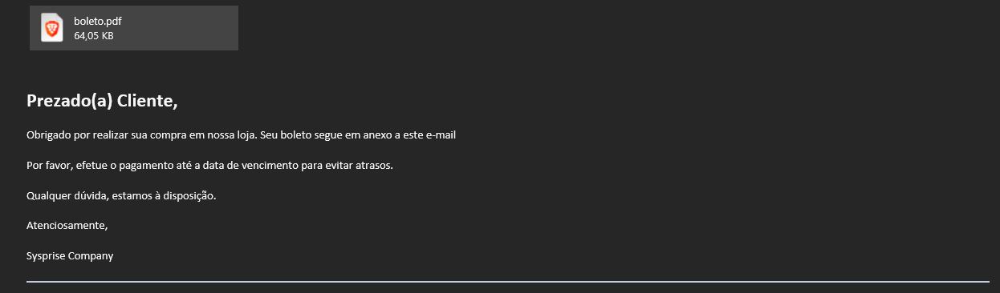
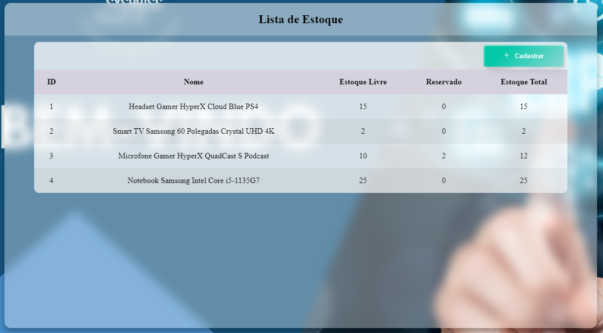

<h1 align="center"> Sysprise </h1>

    

## Índice

* [Descrição do Projeto](#descrição-do-projeto)
* [Status do Projeto](#status-do-Projeto)
* [Funcionalidades](#funcionalidades)
* [Tecnologias utilizadas](#tecnologias-utilizadas)
* [Licença](#licença)
* [Conclusão](#conclusão)

## Descrição do Projeto

Aplicação em desenvolvimento que tem o objetivo de fornecer uma API com os recursos essenciais para um sistema ERP, construído com Spring Boot.

Atualmente o projeto esta sendo movido para uma arquitetura distribuída, onde serão implementadas tecnologias como `gRPC` :heavy_check_mark:, `IC`, `KeyCloak` e `RabbitMq` :heavy_check_mark:.

Partes do monólito que foram movidas para projetos/repositórios distintos:

* [Produto](https://github.com/cristian486/sysprise-produto)

* [Categoria](https://github.com/cristian486/sysprise-categoria)

* [Unidade](https://github.com/cristian486/sysprise-unidade)

* [Pessoa](https://github.com/cristian486/sysprise-pessoa)

* [Contato](https://github.com/cristian486/sysprise-contato)

* [Endereço](https://github.com/cristian486/sysprise-endereco)

* [Compra](https://github.com/cristian486/sysprise-compra)

* [Venda](https://github.com/cristian486/sysprise-venda)

* [Estoque](https://github.com/cristian486/sysprise-estoque)

* [E-mail](https://github.com/cristian486/sysprise-email)

## Status do Projeto

:construction: Projeto em construção :construction:

## Funcionalidades

Na versão de monólito (descontinuada) o sistema possibilita as operações básicas de cadastro, atualização, listagem e exclusão de pessoa física e jurídica, produto, funcionário, usuário, cidade, tipo de pessoa, cidade, estado, endereço, contatos, unidade, venda e compra.

Na versão distribuída algumas coisas ainda não foram implementadas como a parte relacionada a funcionário e usuário (esta será delegada ao KeyCloak), porém há algumas funcionalidades presentes somente nesta versão, como o controle de estoque através de compras/vendas e a geração dinâmica de e-mails quando uma compra ou venda são realizadas como pode ser visto nas imagens abaixo.

### E-mail Venda

### E-mail Compra

### Tela de Estoque

Como dito anteriormente o controle do estoque é realizado via compras e vendas, sendo que quando uma saída é cadastrada algumas verificações são realizadas pelo sistema que podem impedir que ela aconteça, sendo elas:

* Ter muitas vendas com status *Aguardando Pagamento* vinculadas a esse cliente.
* Caso não exista quantidade livre em estoque o suficiente para atender a demanda.

Pode-se notar na imagem acima que para determinado produto há a reserva de duas unidades. Caso seja cadastrada uma saída com 12 unidades ela será automaticamente cancelada pelo sistema.

Algumas curiosidades a respeito do funcionamento do sistema:

* Há cache das informações somente nos dados de Cidade e Estado, já que é esperado que haja um grande fluxo de alterações e cadastros nas demais possibilidades.

* É utilizado o *Client Streaming* do gRPC para o cadastro dos contatos de pessoa física e jurídica.

* Os serviços de E-mail e Estoque são acessíveis somente através do Broker

## Tecnologias utilizadas

- ``Java``
- ``Spring Boot``
- ``Spring Data JPA``
- ``Spring Security``
- ``Spring MVC``
- ``Flyway``
- ``MySql``
- ``Spring Doc``
- ``Lombok``
- ``Docker``
- ``RabbitMq``
- ``gRPC``

## Licença

GNU GENERAL PUBLIC LICENSE v3

## Conclusão

Através do desenvolvimento deste projeto pode-se compreender um pouco mais sobre o funcionamento da arquitetura distribuída. Ficaram visíveis os novos desafios e a complexidade que este tipo de abordagem implica como por exemplo lidar com erros, o SOF (Single Point of Failure) que neste caso diria que seria o gRPC e o RabbitMq, o que fazer caso o outro serviço esteja fora do ar.

Está sendo muito satisfatório construir esta aplicação e conforme for adquirindo conhecimento irei modificando-a e corrigindo os pontos necessários.