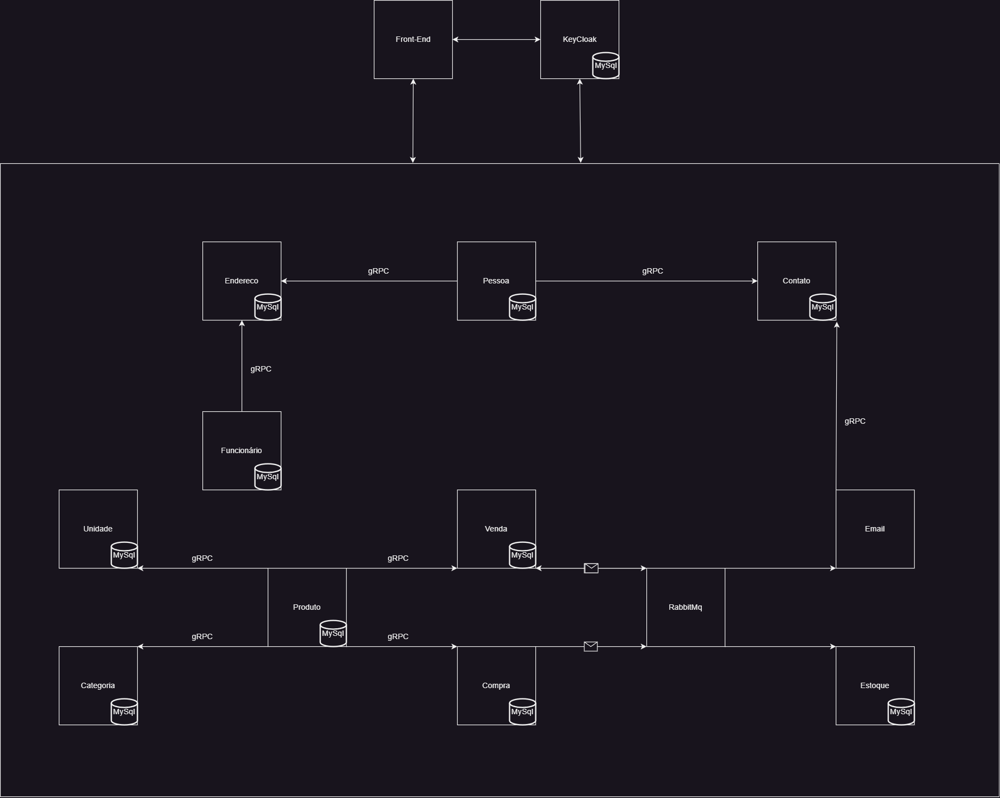
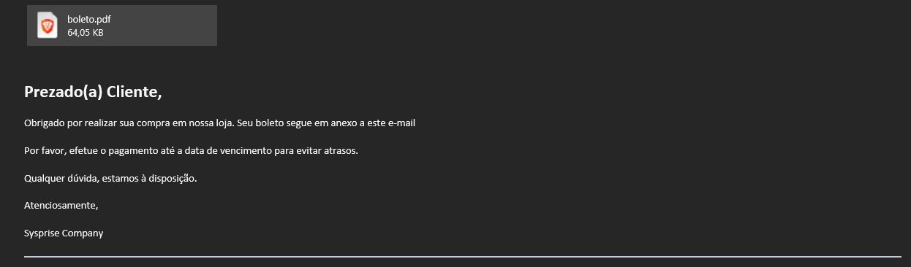
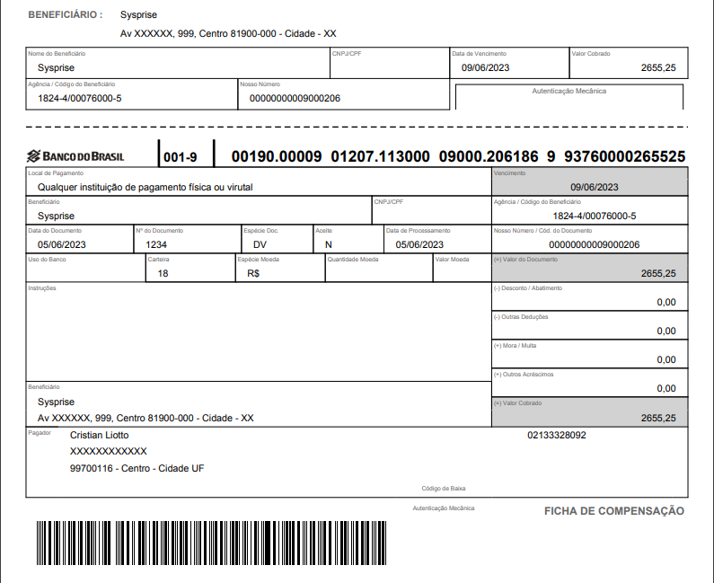
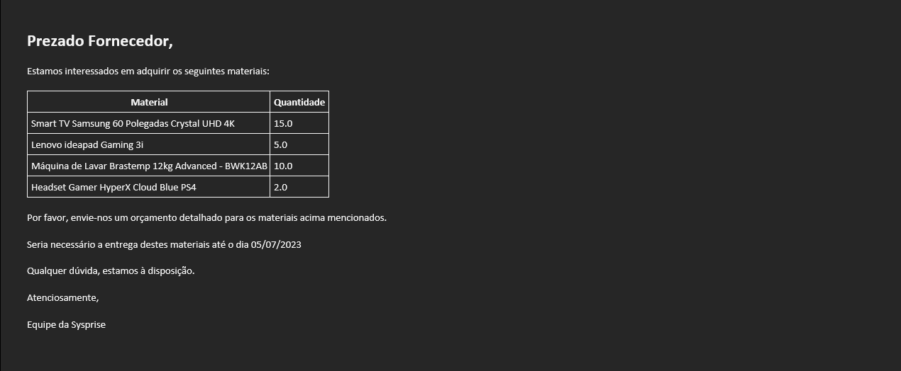
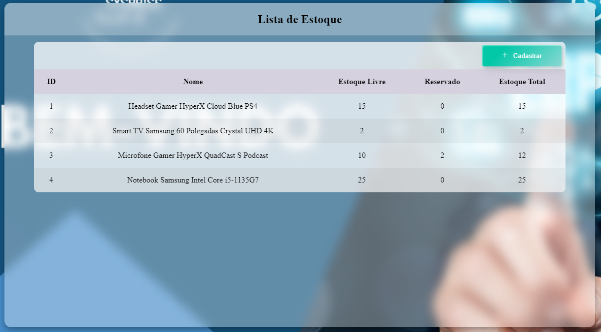

<h1 align="center"> Sysprise </h1>

    

## Índice

* [Descrição do Projeto](#descrição-do-projeto)
* [Status do Projeto](#status-do-Projeto)
* [Arquitetura](#arquitetura)
* [Funcionalidades](#funcionalidades)
* [Tecnologias utilizadas](#tecnologias-utilizadas)
* [Licença](#licença)
* [Conclusão](#conclusão)

## Descrição do Projeto

A aplicação em desenvolvimento é um sistema ERP construído com Spring Boot, que tem como objetivo fornecer uma API com os recursos essenciais para esse tipo de sistema.

Com base na estrutura do Spring Boot, a aplicação oferece uma arquitetura robusta e escalável para atender às necessidades de um ERP. Através da API desenvolvida, é possível acessar e gerenciar diversas funcionalidades fundamentais para a operação de um sistema ERP.

Aqui irei abordar a migração do monólito para uma arquitetura distribuída, onde irei implementar tecnologias como `gRPC` :heavy_check_mark:, `IC`, `KeyCloak` e `RabbitMq` :heavy_check_mark:.

Serviços que estão prontos:

* [Produto](https://github.com/cristian486/sysprise-produto)

* [Categoria](https://github.com/cristian486/sysprise-categoria)

* [Unidade](https://github.com/cristian486/sysprise-unidade)

* [Pessoa](https://github.com/cristian486/sysprise-pessoa)

* [Contato](https://github.com/cristian486/sysprise-contato)

* [Endereço](https://github.com/cristian486/sysprise-endereco)

* [Compra](https://github.com/cristian486/sysprise-compra)

* [Venda](https://github.com/cristian486/sysprise-venda)

* [Estoque](https://github.com/cristian486/sysprise-estoque)

* [E-mail](https://github.com/cristian486/sysprise-email)

## Status do Projeto

:construction: Projeto em construção :construction:

## Arquitetura

A arquitetura inclui os seguintes serviços:

* Serviço de Pessoa Física e Jurídica: Esse serviço é responsável pelo gerenciamento de informações de pessoas físicas e jurídicas. Ele fornece operações CRUD (Create, Read, Update, Delete) para criar, buscar, atualizar e excluir registros de pessoas.

* Serviço de Produto: Esse serviço gerencia os produtos disponíveis no sistema. Ele oferece operações CRUD para criar, buscar, atualizar e excluir informações de produtos. Isso inclui atributos como nome, descrição, preço, entre outros.

* Serviço de Tipo de Pessoa: Esse serviço trata dos tipos de pessoas, como cliente, fornecedor, etc. Ele permite o CRUD de tipos de pessoa e associações com os registros de pessoas.

* Serviço de Categoria do Produto: Esse serviço gerencia as categorias às quais os produtos podem pertencer. Ele oferece operações CRUD para criar, buscar, atualizar e excluir categorias de produtos.

* Serviço de Unidade do Produto: Esse serviço trata das unidades de medida dos produtos. Ele permite a criação, busca, atualização e exclusão de unidades de medida utilizadas para os produtos.

* Serviço de Contato de Pessoa: Esse serviço gerencia os contatos associados a uma pessoa. Uma pessoa pode ter vários contatos, como telefone e e-mail. Ele fornece operações CRUD para criar, buscar, atualizar e excluir informações de contato.

* Serviço de Endereço de Pessoa: Esse serviço trata dos endereços associados a uma pessoa. Ele permite a criação, busca, atualização e exclusão de endereços de pessoas físicas e jurídicas.

* Serviço de Funcionário: Esse serviço lida com o gerenciamento de funcionários na empresa. Ele oferece operações CRUD para criar, buscar, atualizar e excluir informações de funcionários, como nome, cargo, data de admissão, etc.

* Serviço de Compra e Venda: Esse serviço é responsável pela criação e gerenciamento de operações de compra e venda. Ele utiliza outros dois serviços, que são o serviço de e-mail e o serviço de estoque. Quando uma compra é gerada, um e-mail é criado e enviado para o fornecedor selecionado. Quando uma venda é gerada, um boleto é gerado e enviado por e-mail para o cliente efetuar o pagamento. Além disso, ele verifica se o cliente possui compras em aberto e se há estoque suficiente para atender à venda. A quantidade necessária de produtos é reservada para a venda, evitando que seja utilizada em outras vendas. Caso a venda seja cancelada ou efetuada, a quantidade é ajustada adequadamente.

* A comunicação entre os serviços de compra/venda com o estoque é realizada via RabbitMQ, que é um sistema de mensageria assíncrona. Além disso, a comunicação entre os demais serviços, caso necessário, é realizada através do gRPC, que é um framework de comunicação remota de alto desempenho.

Um exemplo das aplicações e como elas se comunicam:

## Funcionalidades

 
No módulo de cadastro, é possível registrar detalhes sobre clientes, tanto pessoas físicas como jurídicas, incluindo informações de identificação, dados de contato e endereços. O sistema também permite a gestão de produtos, com a possibilidade de cadastrar novos itens, atualizar suas informações e remover aqueles que não são mais necessários.

Além disso, o ERP contempla funcionalidades relacionadas à gestão de funcionários, permitindo o registro de informações sobre colaboradores, como nome, cargo, departamento e dados de contato. O módulo de usuários permite criar e gerenciar contas de acesso ao sistema, controlando as permissões de cada usuário de acordo com suas responsabilidades.

O módulo de vendas e compras é responsável por gerenciar transações comerciais, permitindo o registro de vendas realizadas aos clientes e compras feitas dos fornecedores.

### Exemplo do e-mail de uma venda e o boleto

### Exemplo do e-mail de uma compra

### Exemplo do produto reservado

Pode-se notar na imagem acima que para determinado produto há a reserva de duas unidades. Caso seja cadastrada uma saída com mais de 10 unidades ela será automaticamente cancelada pelo sistema.

## Tecnologias utilizadas

- ``Java``
- ``Spring Boot``
- ``Spring Data JPA``
- ``Spring Security``
- ``Spring MVC``
- ``Flyway``
- ``MySql``
- ``Spring Doc``
- ``Lombok``
- ``Docker``
- ``RabbitMq``
- ``gRPC``

## Licença

GNU GENERAL PUBLIC LICENSE v3

## Conclusão

Através do desenvolvimento deste projeto pode-se compreender um pouco mais sobre o funcionamento da arquitetura distribuída. Ficaram visíveis os novos desafios e a complexidade que este tipo de abordagem implica como por exemplo lidar com erros, o SOF (Single Point of Failure) que neste caso diria que seria o gRPC e o RabbitMq, o que fazer caso o outro serviço esteja fora do ar.

Está sendo muito satisfatório construir esta aplicação e conforme for adquirindo conhecimento irei modificando-a e corrigindo os pontos necessários.
